# Maya 플러그인 컴파일

## 1. Devkit 다운로드

<https://www.autodesk.com/developer-network/platform-technologies/maya>

- 페이지의 마지막 까지 스크롤 한다.

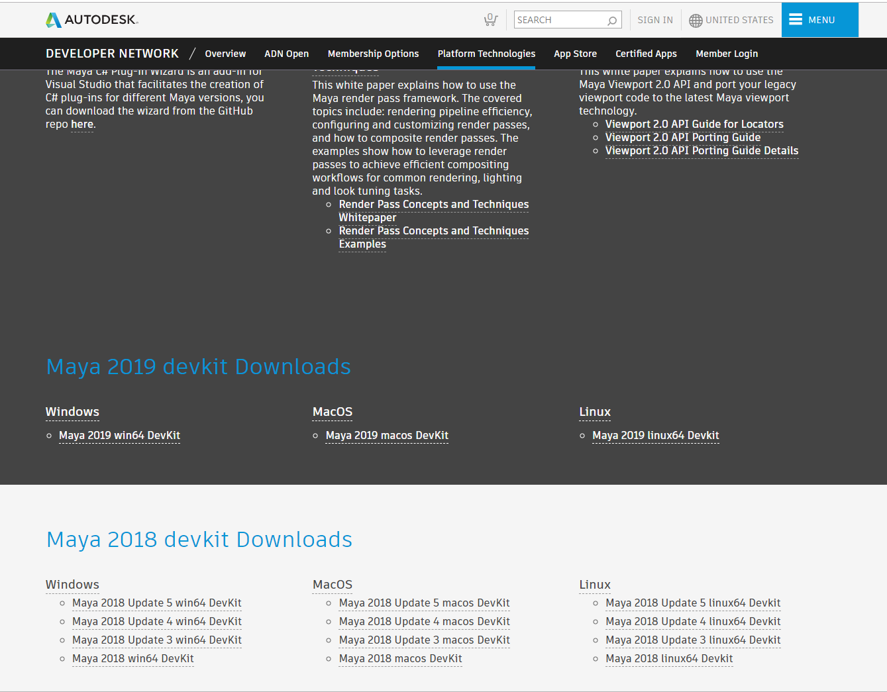

## 2. 설치

- "devkitBase" 폴더를 "C:\Program Files\Autodesk\Maya2018"에 복사한다.
  


- Visual Studio 설치

<https://visualstudio.microsoft.com/ko/downloads/>

## 3. 프로젝트 생성 및 솔루션 설정

- 프로젝트를 생성한다.

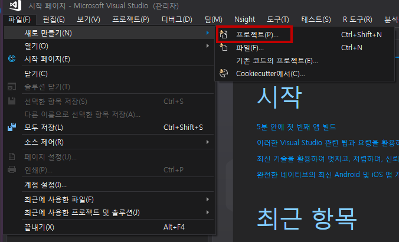


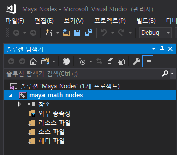

## 4. footprint 프로젝트를 추가 한다


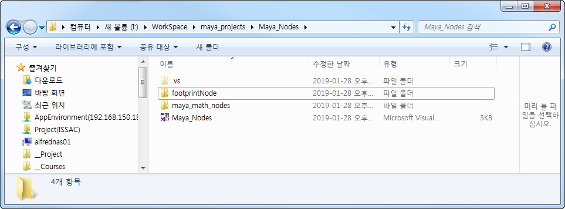

## 5. 테스트 파일 추가

- C:\Program Files\Autodesk\Maya2018\devkitBase\devkit\plug-ins\footPrintNode\footPrintNode.cpp 파일을 복사한다.

- 프로젝트 폴더에 붙여넣기 한다.

- footprintNode 프로젝트에서 소스파일 > 추가 > 기존 항목을 선택한다.

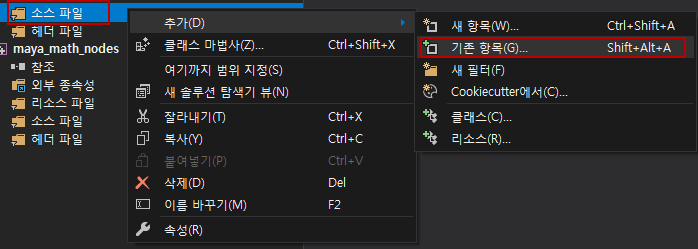

- 붙여넣기한 **footPrintNode.cpp** 추가한다.


## 5. 프로젝트 셋팅

- 프로젝트를 선택하고 MLB 클릭한다. 팝업 메뉴에 속성을 선택한다.

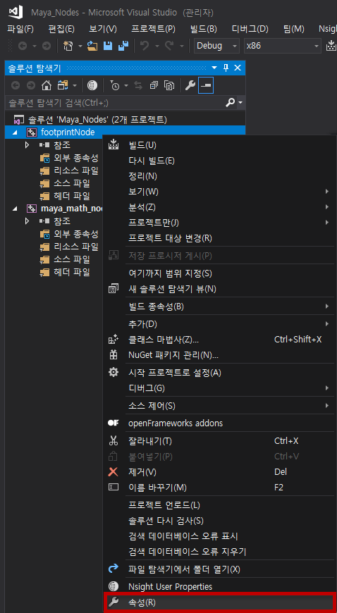

## 6. 일반 셋팅

- 구성: 모든구성
- 출력 디렉터리: $(ProjectDir)build\
- 중간 디렉터리: $(ProjectDir)intermediates\
- 대상 확장자: .mll
- 플랫폼 도구 집합: Visual Studio 2017
- 구성 형식: .dll
- 적용버튼을 클릭한 후 구성 관리자를 클릭한다.

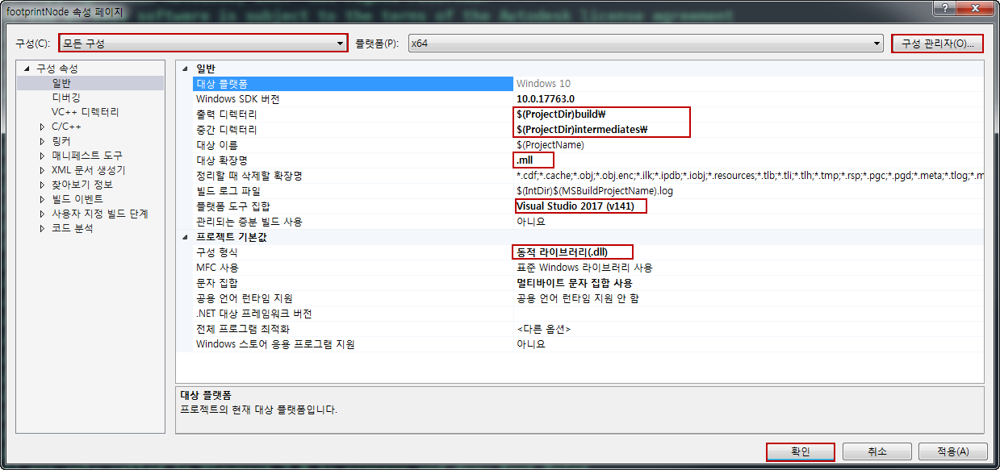

- 활성 솔류션 플랫폼에서 x86을 삭제한다.

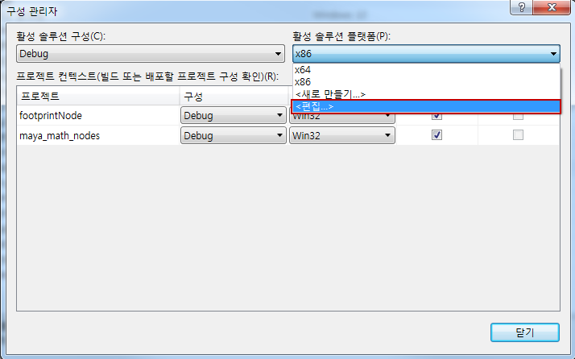

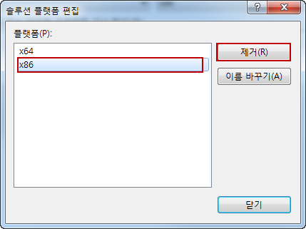

## 7. 디버그 셋팅

- 구성: Debug
- 출력 디렉터리: $(ProjectDir)build\debug\
- 중간 디렉터리: $(ProjectDir)intermediates\debug\


## 8. 릴리즈 셋팅

- 구성: Release
- 출력 디렉터리: $(ProjectDir)build\debug\
- 중간 디렉터리: $(ProjectDir)intermediates\debug\

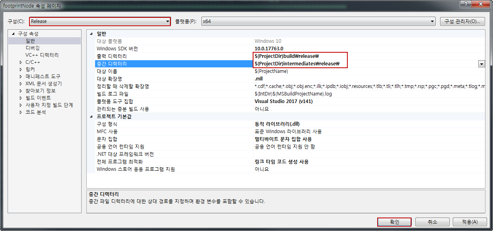

## 9. Include 셋팅

- 포함 디렉터리 : C:\Program Files\Autodesk\Maya2018\devkitBase\include 추가

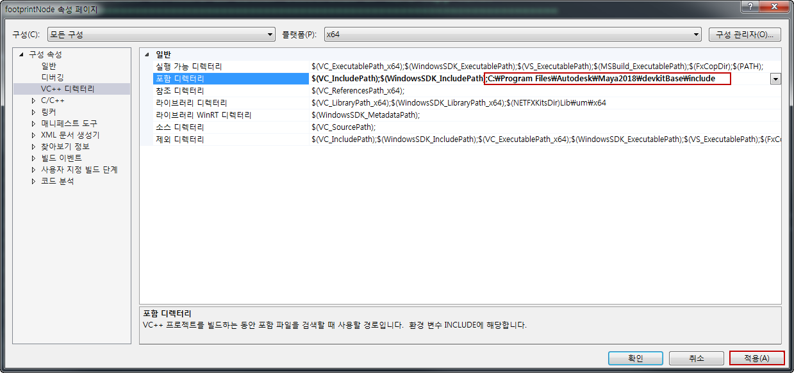

## 10. 링커 셋팅

- 링커 선택
- 추가 라이브러리 디렉터리: C:\Program Files\Autodesk\Maya2018\devkitBase\lib

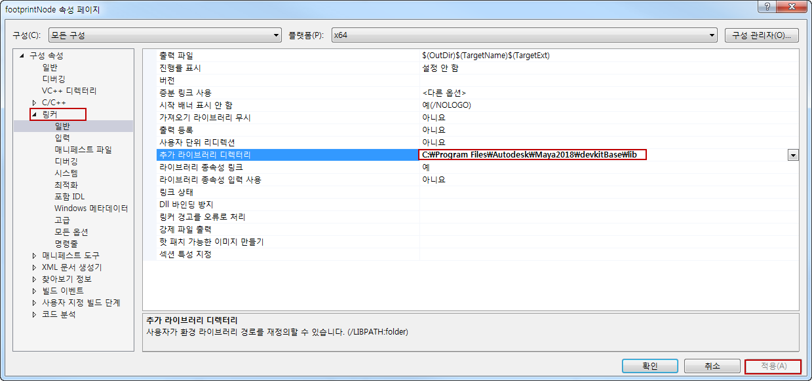

- 링커 > 입력 선택
- 추가 종속성 추가
  
>OpenMaya.lib
>OpenMayaRender.lib
>OpenMayaUI.lib
>Foundation.lib
>opengl32.lib


- 링커 > 명령줄 선택
- 추가 옵션 추가

> /export:initializePlugin /export:uninitializePlugin

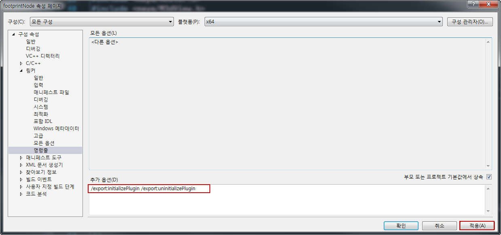

## 11. 구성 속성 셋팅

- 구성 속성 선택
- 전처리기 정의 추가
  
>WIN32
_WIN64
_WINDOWS
_USRDLL
NT_PLUGIN
REQUIRE_IOSTREAM


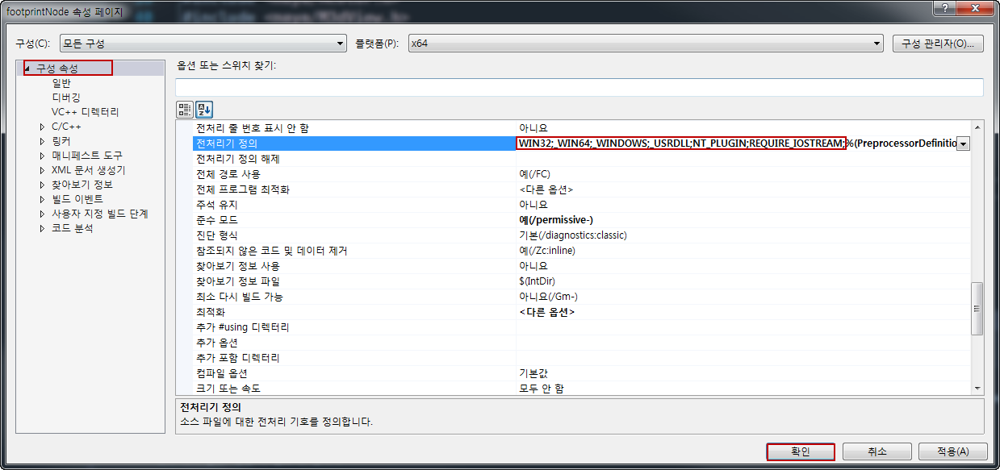

## getenv 에러 픽스

```cpp
#pragma warning(disable : 4996) //추가
static bool sUseLegacyDraw = (getenv("MAYA_ENABLE_VP2_PLUGIN_LOCATOR_LEGACY_DRAW") != NULL);
```